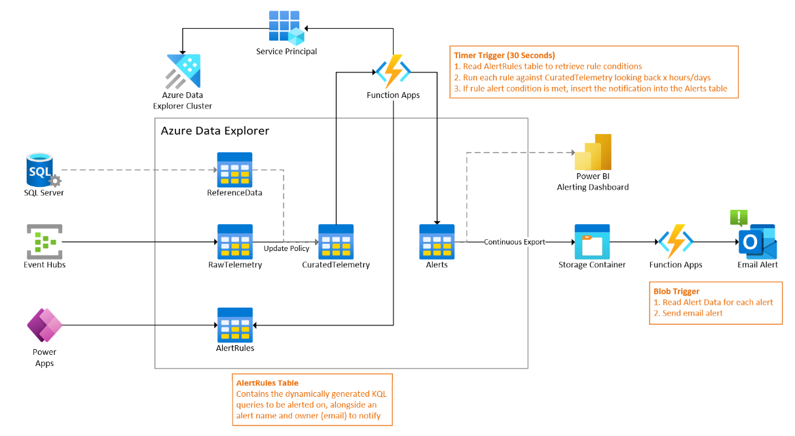
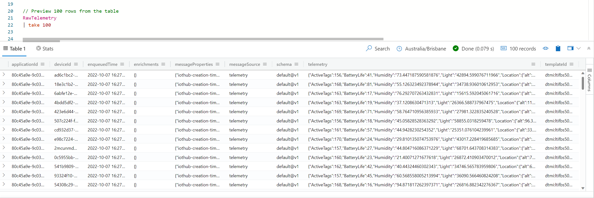

# Azure Data Explorer: Condition-based Alerting Framework

> This repository contains a demo of how condition-based alerting could work with Azure Data Explorer. It is intended as a proof of concept and provided as it.

## Introduction

At the time of creating this repository, Azure Data Explorer does not have a built-in alerting engine. This means that the service cannot write data out to an Event Hub, Event Grid, or Service Bus.

In many instances, an organization may wish to alert someone if new data meets a pre-defined criteria / list of conditions. Given various limitations, we are aiming to solve this challenge using a combination of Azure Function Apps and Azure Data Explorer's Update Policies.

## Architecture



### Requirements & Constraints

- Raw telemetry data is ingested into RawTelemetry table every second.
- Together with reference data stored in a SQL Server, telemetry data is parsed and curated into a destination table.
- Alerts are defined via a PowerApps UI and stored in an ADX table.
- A Function App on a 10 second timer trigger reads runs the user-defined rules over new and existing data in the table and writes alerts into an Alerts table if the rule was met.
- Alerts written to the Alerts table are continously exported to a Storage Container.
- A Function App will pick up alerts written to blob and email them to the alert owner.
- Optionally: A Power BI report is connected to the Alerts table to act as a dashboard of alerts.

#### Azure Functions vs. Update Policies

Azure Data Explorer Update Policies are KQL functions that are executed when new data is ingested into a given table. A known limitation is that Update Policies cannot look back at previously ingested data and thus we are unable to run our conditions that require looking back further than the data currently being ingested.

Update Policies cannot call plugins or read from external tables.

However, at the time of writing, we are unsure if a function on a Timer-trigger will have to finish executing before a new function execution can be invoked. If this is the case, queuing will occur if the function execution takes longer to run than the scheduled trigger interval (eg. 10 seconds).

## Chapter 1: ADX Table Creation

Run the following KQL query to create the data tables:

```sql
.execute database script <|
// Create RawTelemetry table
.create-merge table RawTelemetry (applicationId: guid, deviceId: string, enqueuedTime: datetime, enrichments: dynamic, messageProperties: dynamic, messageSource: string, ['schema']: string, telemetry: dynamic, templateId: string)
// Create CuratedTelemetry table
.create-merge table CuratedTelemetry (DeviceId: string, EnqueuedTime: datetime, ActiveTags: int, BatteryLife: real, Humidity: real, Light: real, Location: dynamic, LostTags: int, Pressure: real, Shock: real, Status: string, Temp: real, Tilt: real, TotalTags: int, TransportationMode: string, NumOfTagsCalculated: int)
// Create AlertRules table
.create-merge table AlertRules (RuleId: string, RuleName: string, Query: string, Importance: string, AlertOwner: string)
```

Connect an Event Hub to your Azure Data Explorer Cluster that emits data in this format. The data should be ingested from the Event Hub into ADX.

Next, set the ingestion batching policy for the table to 5 second batches:

```sql
// Set ingestion batching policy
.alter table RawTelemetry policy ingestionbatching @'{"MaximumBatchingTimeSpan":"00:00:05", "MaximumNumberOfItems": 1000, "MaximumRawDataSizeMB": 1024}'
```

Once data is flowing, you should be able to inspect the table and view the first 100 records like so:

```sql
// Preview 100 rows from the table
RawTelemetry
| take 100
```



If you are not getting any data after several seconds, you can check for ingestion failures:

```sql
.show ingestion failures
```

